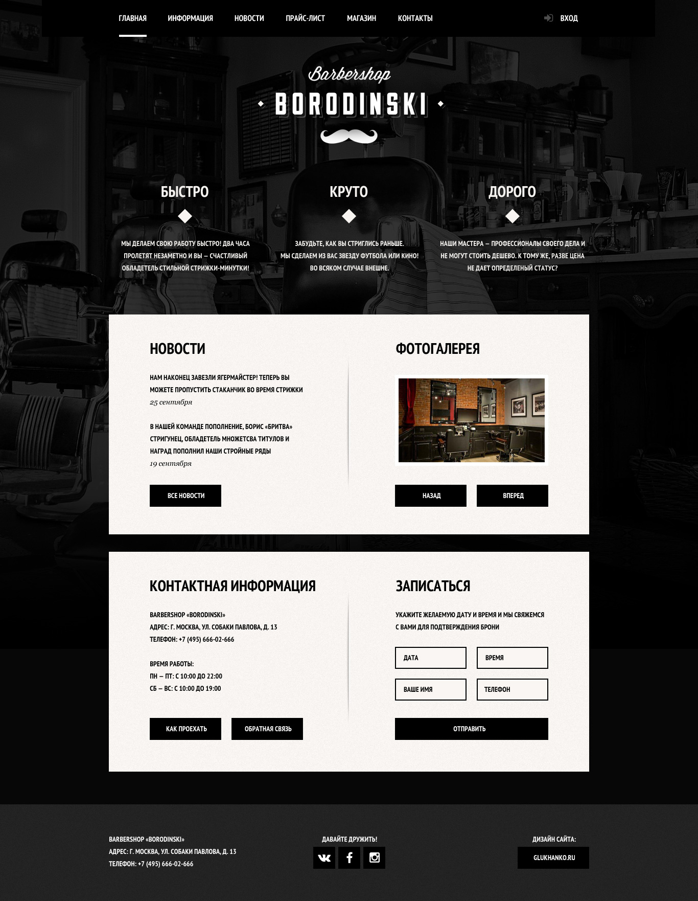
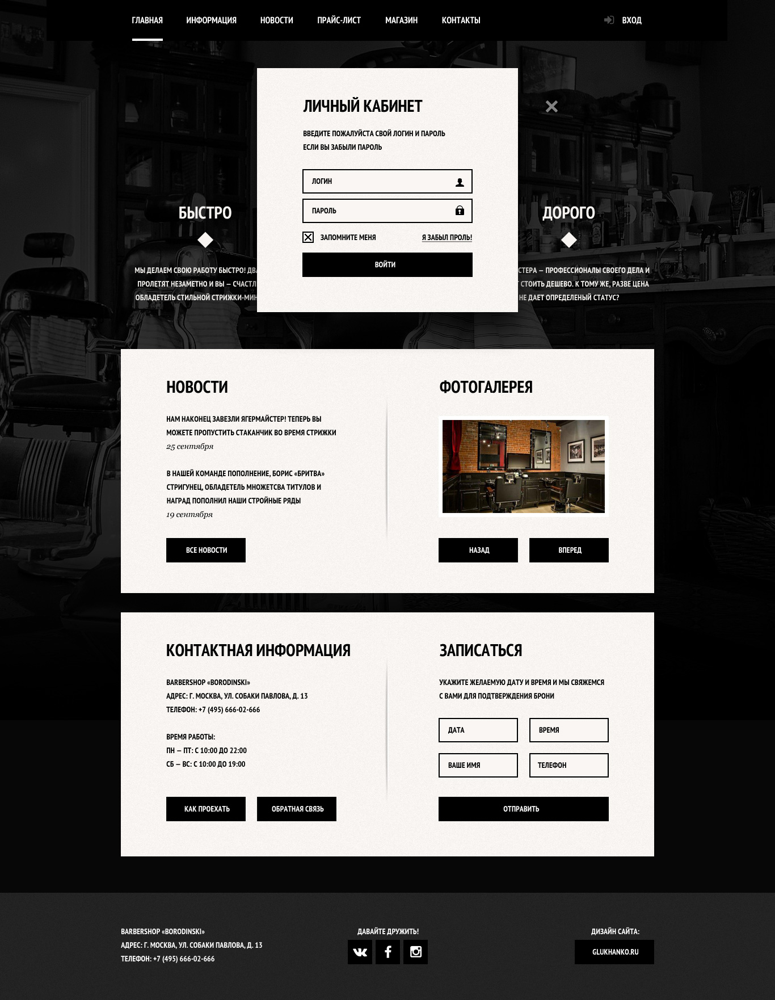
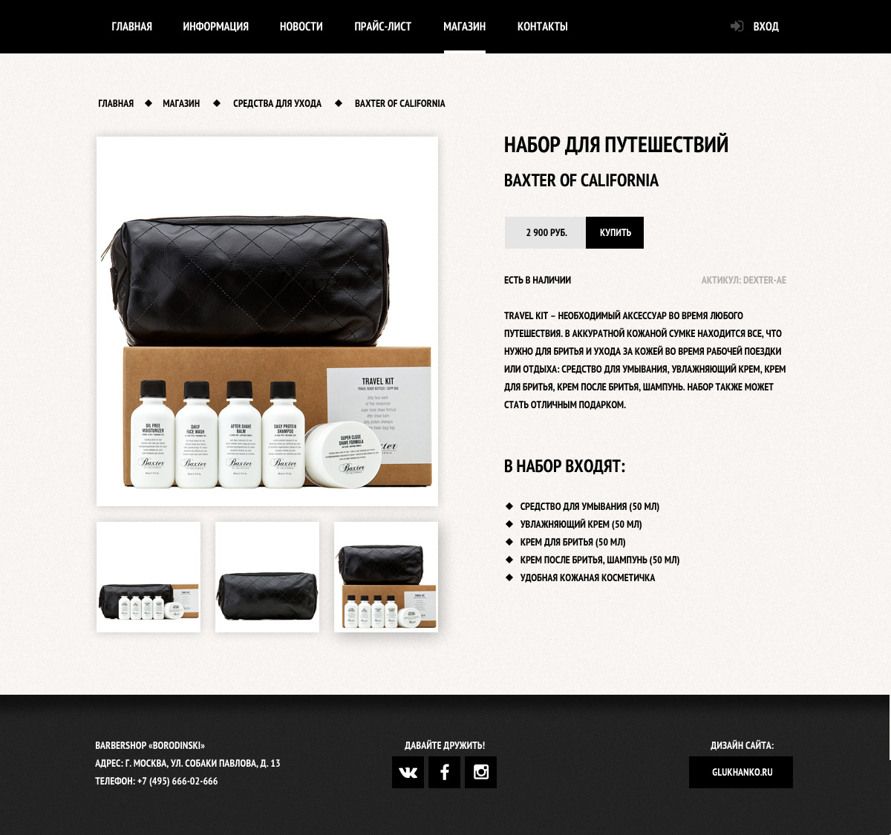
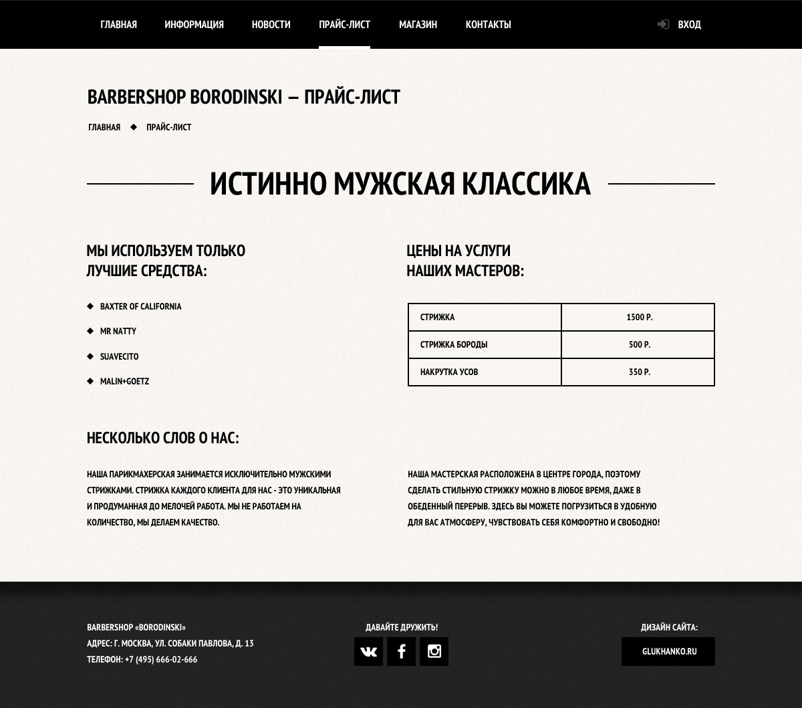
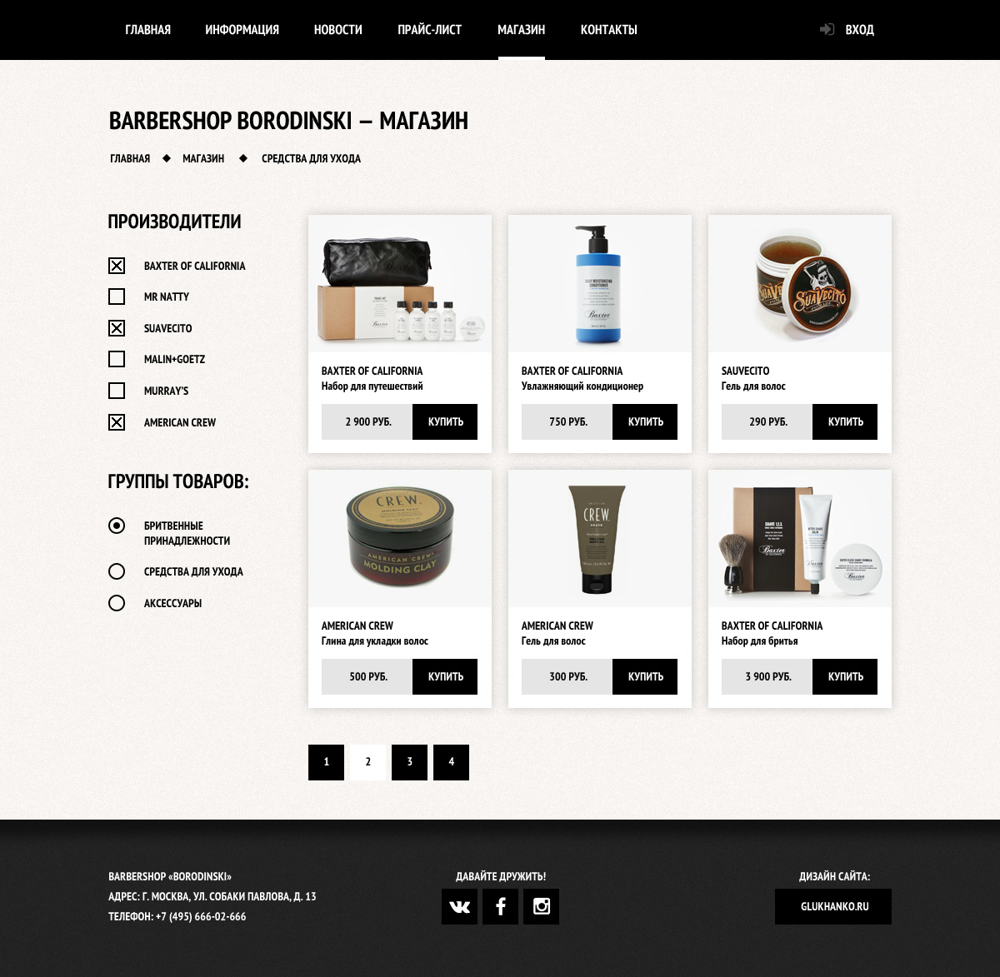

# Barbershop

Верстка макета *Barbershop* от [htmlacademy](https://htmlacademy.ru)

## Макет






## Как посмотреть?

У вас должны быть установлены:

- [ruby](https://www.ruby-lang.org/ru/downloads/)
- [nodejs и npm](https://nodejs.org/)
- [bower](http://bower.io/)
- [gulp](http://gulpjs.com/)

Далее выполняем:

```
sudo npm i
gulp
```

После выкачивания всех зависимостей проекта и успешной первичной сборки, запустите задачу `gulp`.
Результат сборки можете видеть в папке `dist`

Если хотите начать редактировать то вместо команды `gulp ` наберите команду `gulp edit`

--

<p align="center">
    <a href="http://webmole.ru">
        
    </a>
</p>


